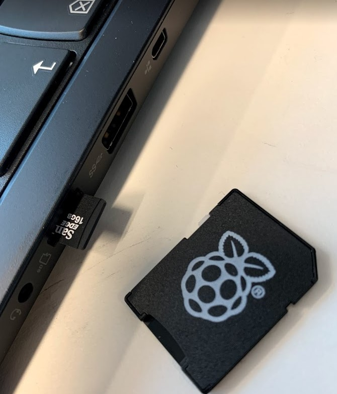

# 3DPrinters
Everything 3D printer related for Kuben vgs

## 3D printer-crew 2020
* Tobias
* Kåre
* Robin
* Eirik
* Hai

# Robotikklinja

Robotikklinja har fra og med 13.11.2019 to stykk Pusa I3 MK3 3D printers. 

## Regler for bruk

### Hensikt
Vi lærer og elever på avdelningen ønsker at printerne skal kunne brukes med mest mulig frihet og minst mulig styr og problemer. Derfor kommer vi øverens om noen grundleggende regler for bruk av dem. Vi håper at det skal lede til at vi ikke trenger å låse dem bort.

#### Utkast til regler
* Opplæring på regler og best practice innen bruk
* Bruk endest filamet som er kjøpt in av kuben
* Noen må passe på printerne under bruk, ikke print nattetid, ta hellre pause

#### Åpne spørsmål
* Hvem bestiller hvilken plastik?
* Ska vi tillate flere typer plastik?
* Hvem fikser printers? Skall det dokumenteres?
* Hvor lange print får man printe?
* Hvem får printe først?
* Finns det noe som man ikke får printe? Har noe høyere prioritet til eksempel egen design, skolearbeid?

### SD-kort og opplading
Begge printerne har nå SD-kort som er kompatible med våre elev-PCs

 

#### Vi har testet SD-minneskort med wifi-støtte
I 2019 så ble 2 flashair SD kort testet for å se om vi kunde laste opp filer over nettverk sinden vi ikke hade SD-kort-leser i elev-laptops.
Tyværr så ble korten ødelagt og vi fikk det ikke til å virke men det kan prøves igjen.
Disse gudier ble brukt:
* [Prusa guide to Wifi Sd cards (2018)](https://blog.prusaprinters.org/easy-wireless-printing-with-flashair-sd-cards/)
* [Wifi to SD from slicer](http://bobbyromeo.com/uncategorized/automate-syncing-of-g-code-files-toshiba-flashair-prusa-mk3-3d-printer/)
* [WO-4 SD cards works in 2019](https://www.reddit.com/r/prusa3d/comments/bsqqvn/toshiba_flashair_support/)

